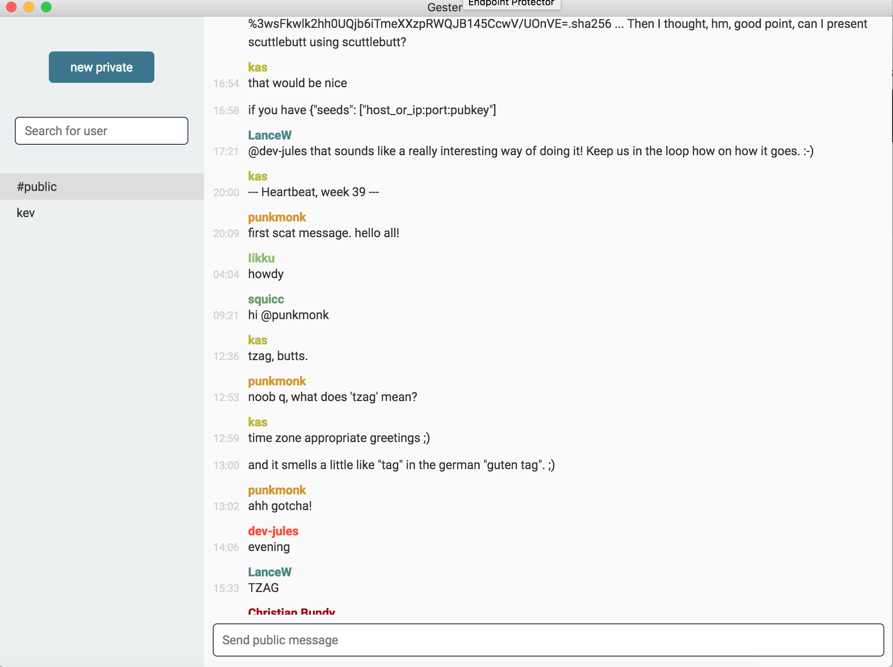

# :hamster: gester :hamster:
p2p chat app built on scuttlebutt



more on scuttlebutt: https://www.scuttlebutt.nz/

potentially chat with friends on the same network without even being connected to the internet :raised_hands:

this is just a more user friendly ui for [scat :mouse:](https://github.com/stripedpajamas/scat)

### download binaries
[here](https://github.com/stripedpajamas/gester/releases)

### tips and tricks
- you can press `meta+k` as a shortcut to start a private chat (idea borrowed from Slack)
- you can join a pub from the Help menu
- you can tab complete names and emoji
- click on a name/id (or search for one) to pull up follow/block options
- from the author view, you can assign a new name to someone by double-clicking their name

### install / run from source
```bash
$ npm install
$ npm start
```

### what's happening
gester/scat uses a special message type `scat_message`. this means that if you're using something like [Patchwork](https://github.com/ssbc/patchwork), your feed won't be all gobbled up by chat messages. And scat won't be all gobbled up by your posts. 

but since it's all the same protocol and all the same feeds, all the same people are there. gester/scat uses the `ssb-about` plugin. if your sbot doesn't have this plugin, you will just see ids... no names.

gester/scat will honor self-identification above a 3rd party's identification of another user, and will honor your identification of another user above their own self-identification. a 3rd party's identification of another user is not honored at all.

### license
MIT
